# Meta Verified Phishing Kit Variant - Abuse Reporting Pack

## Executive Summary

This report documents an active Meta Verified-themed phishing campaign delivered via Instagram message request.

The campaign uses a PDF lure named `Meta Verified - Rewards for you.pdf`. Static analysis of the PDF identified an embedded Rebrandly shortlink, which redirects to a Cloudflare-fronted phishing domain:

`hxxps://update[.]active-badgetrust[.]com/badge-submit`

The phishing site presents a fake Meta/reCAPTCHA gate, redirects victims to a fake Meta Verified “Rewards for you” page, and then collects victim/business details, two password entries, and three OTP/2FA attempts.

Live Burp evidence confirmed successful POST requests to:

`hxxps://update[.]active-badgetrust[.]com/api/send-request`

Each captured submission returned:

`{"message":"Success","error_code":0}`

This appears to be an active credential and OTP-harvesting phishing kit targeting Facebook/Meta users and business/page owners.

## Requested Action

Please review and take appropriate action against the relevant abuse infrastructure, including suspension, blocking, takedown, or disabling of the malicious shortlink, phishing domain, customer account, sender account, or related hosted resources where applicable.

## Delivery Method

The lure was delivered through an Instagram message request.

Observed sender:

- Display name: `Chat AI`
- Username: `laurentychsen`
- Account age shown by Instagram: August 2017
- Profile showed no posts and low follower/following counts
- The message contained a Meta Verified-themed lure image and PDF attachment

Observed PDF attachment name:

`Meta Verified - Rewards for you.pdf`

Evidence:

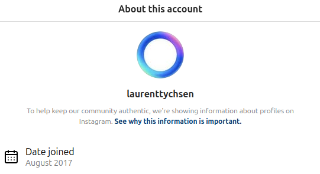

The PDF attachment was served from Meta/Facebook CDN infrastructure as an uploaded messaging attachment. This is not intended to imply that Meta hosted the phishing website. The CDN URL appears to relate to attachment delivery through Instagram/Messenger.

## Malicious File Details

Filename:

`Meta-Verified-Rewards-for-you.pdf`

SHA-256:

`8a3cf1b7676dbee798f84a2b22e41d232575150103dbaf573112d348ee3cfdd4`

File details:

- Type: PDF document, version 1.4
- Pages: 1
- Size: 102,749 bytes
- JavaScript: No
- Encrypted: No
- Form: None

PDF metadata observed:

- Creator: Canva
- Producer: Canva
- Language: `vi-VN`
- Author metadata: `Nguyễn Trọng Hoàng`
- Creation date: `2026-03-08 07:04:50 UTC`

The PDF appears to function as a social-engineering wrapper containing a clickable phishing link, rather than as an exploit document.

Evidence:

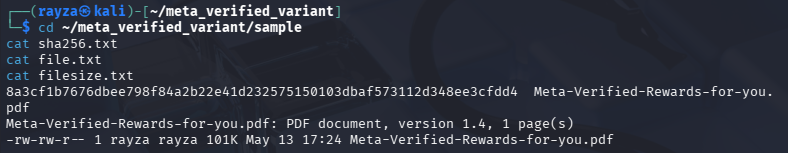

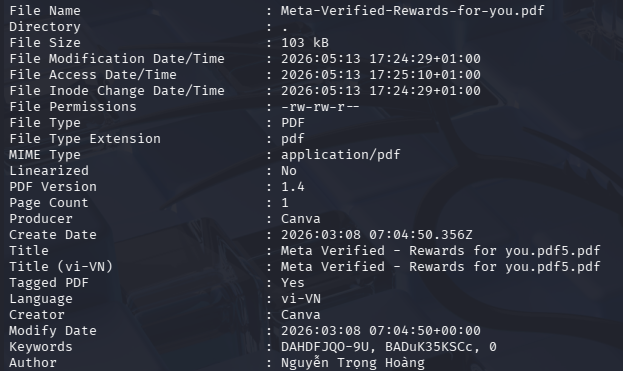

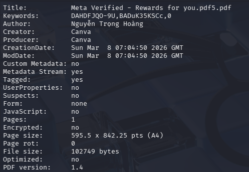

## Embedded URL in PDF

Static analysis of the PDF found the following embedded URI:

`hxxps://rebrand[.]ly/badge-submit`

The PDF object data showed a URI action pointing to the Rebrandly shortlink.

Evidence:

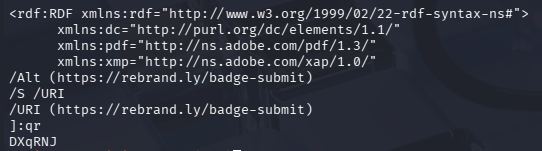

## Redirect Chain

The embedded Rebrandly URL redirected to the phishing domain:

`hxxps://rebrand[.]ly/badge-submit`  
`→ hxxps://update[.]active-badgetrust[.]com/badge-submit`

Observed redirect behaviour:

- Rebrandly returned HTTP 301
- The `Location` header pointed to `https://update.active-badgetrust.com/badge-submit`
- The response included `Engine: Rebrandly.redirect, version 2.1`

When accessed with a browser-like user agent, the final phishing page returned HTTP 200.

Evidence:

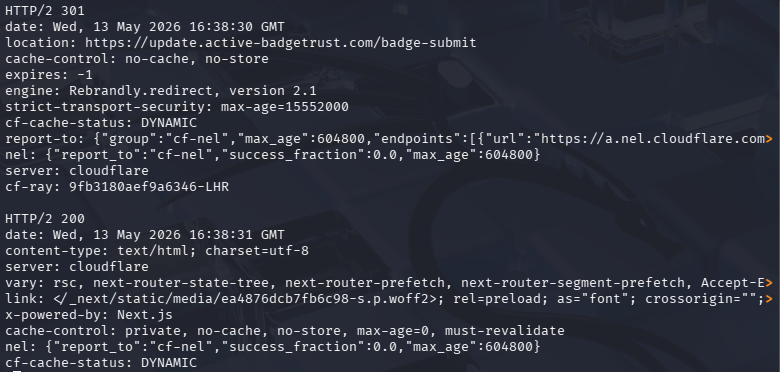

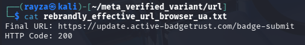

## Phishing Infrastructure

Primary domain:

`active-badgetrust[.]com`

Active phishing host:

`update[.]active-badgetrust[.]com`

Observed routes and endpoints:

- `/badge-submit`
- `/account-center`
- `/api/ip-location?ip=`
- `/api/send-request`
- `/api/notification`

WHOIS information observed:

- Domain: `ACTIVE-BADGETRUST.COM`
- Registrar: Ultahost, Inc.
- Creation date: 2026-05-13
- Updated date: 2026-05-13
- Nameservers:
  - `carmelo.ns.cloudflare.com`
  - `leah.ns.cloudflare.com`

Observed A records:

- `104[.]21[.]40[.]235`
- `172[.]67[.]140[.]1`

These appear to be Cloudflare edge IPs and should be treated as hosting context rather than attacker-owned infrastructure.

Evidence:

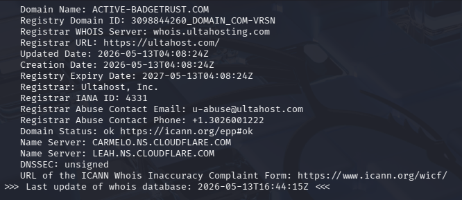

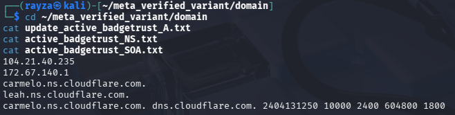

## Landing Page Behaviour

The phishing site presents a fake Meta/reCAPTCHA-style page at:

`hxxps://update[.]active-badgetrust[.]com/badge-submit`

The fake CAPTCHA checkbox uses the element ID:

`checked-capcha`

Selecting the checkbox redirects the victim to:

`/account-center`

Evidence:

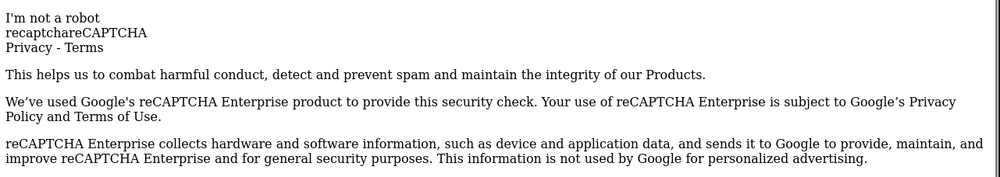

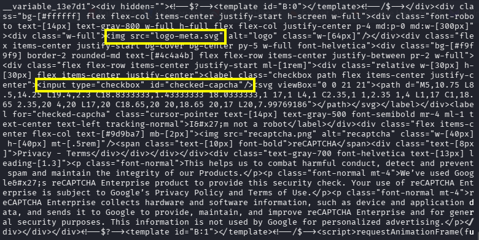

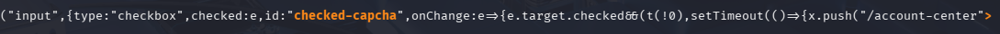

## Account-Center Phishing Page

The `/account-center` route presents a Meta Verified-themed page.

Visible lure text included:

- `Meta Verified - Rewards for you`
- `Show the world that you mean business.`
- `Your ticket id: #4564-ATFD-4865`
- `Submit request`

Evidence:

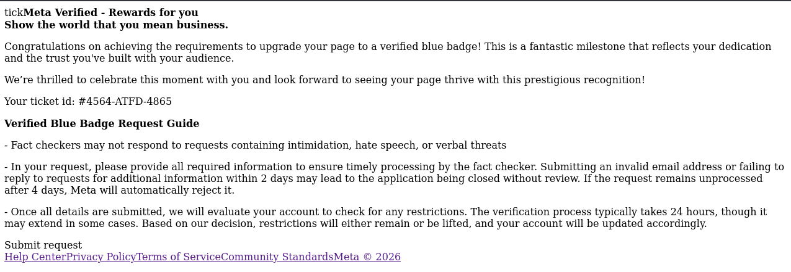

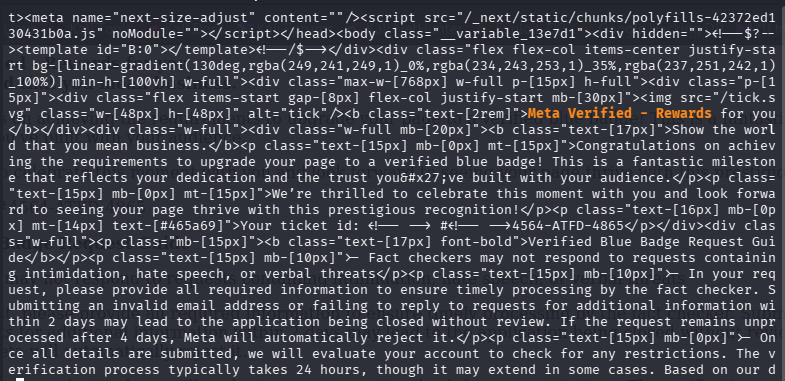

## Data Collection Flow

Static JavaScript analysis and live Burp capture confirmed the phishing workflow collects several categories of victim data.

### Initial victim and business/page information

Fields observed:

- `fullName`
- `email`
- `emailBusiness`
- `fanpage`
- `phone`
- `day`
- `month`
- `year`
- `message` / `issue`
- IP and location data

Evidence:

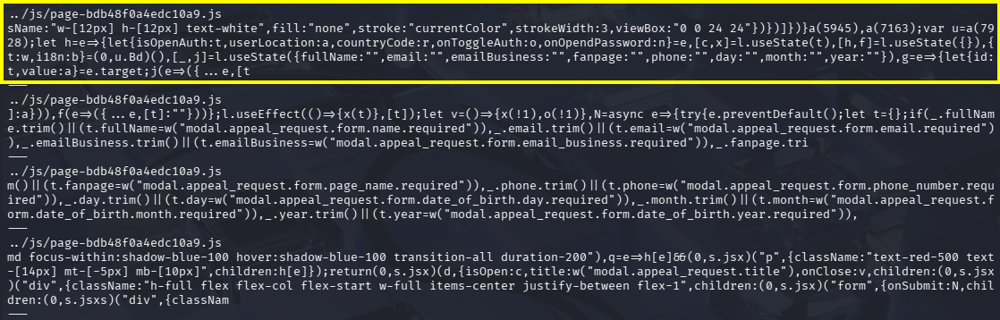

### Password capture

The kit captures two password entries:

- `password`
- `passwordSecond`

The first password attempt is deliberately followed by an incorrect-password style warning, prompting the victim to enter the password again.

Evidence:

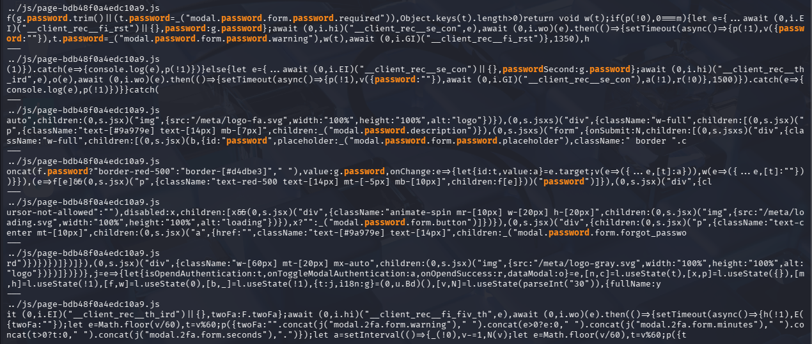

### OTP / 2FA capture

The kit captures up to three OTP/2FA values:

- `twoFa`
- `twoFaSecond`
- `twoFaThird`

Live testing confirmed that entering an incorrect OTP twice led to a third OTP request, after which the site displayed a success message and a button redirecting to the real Facebook site.

Evidence:

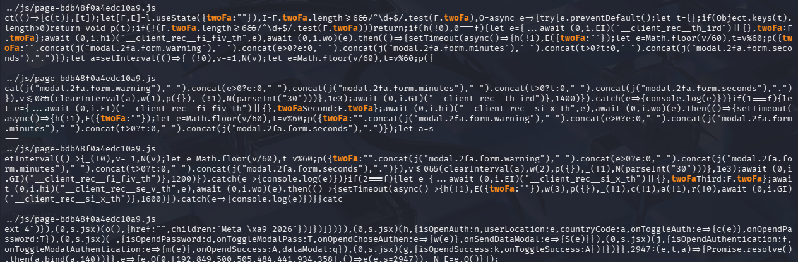

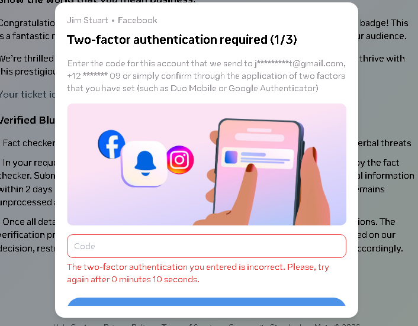

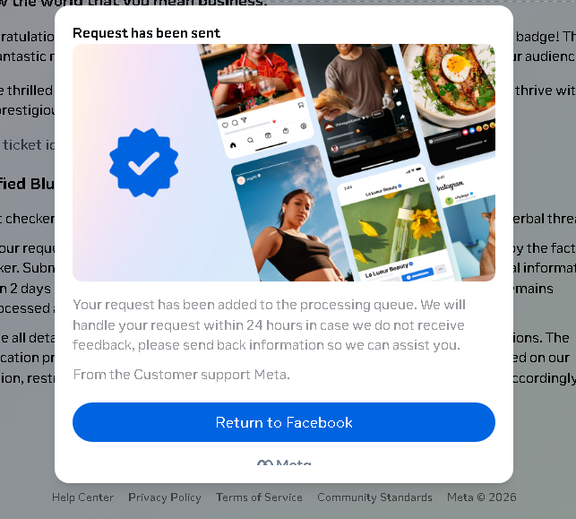

## Live Exfiltration Confirmation

A controlled Burp capture confirmed successful POST requests to:

`hxxps://update[.]active-badgetrust[.]com/api/send-request`

Observed sequence:

1. `POST /api/send-request` - victim information plus first password
2. `POST /api/send-request` - victim information plus first and second password
3. `POST /api/send-request` - first OTP/2FA value
4. `POST /api/send-request` - second OTP/2FA value
5. `POST /api/send-request` - third OTP/2FA value

Each `/api/send-request` response returned:

`{"message":"Success","error_code":0}`

The request body format observed was JSON containing a `data` field. The `data` field contained stringified victim data.

Redacted example structure:

`{"data":"{\"fullName\":\"[REDACTED]\",\"email\":\"[REDACTED]\",\"password\":\"[REDACTED]\"}"}`

Evidence:

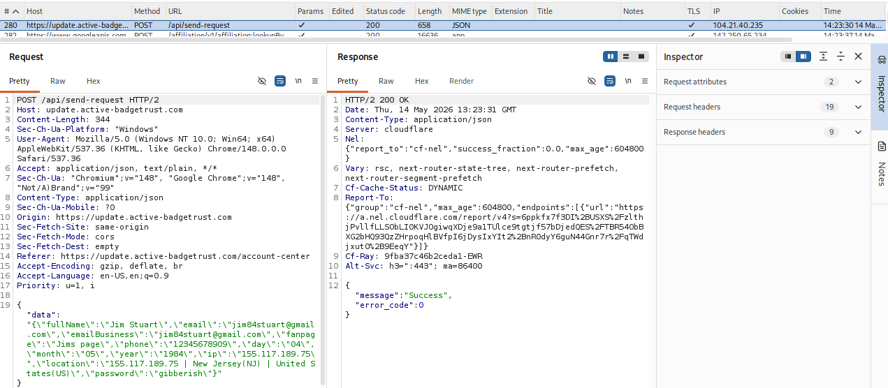

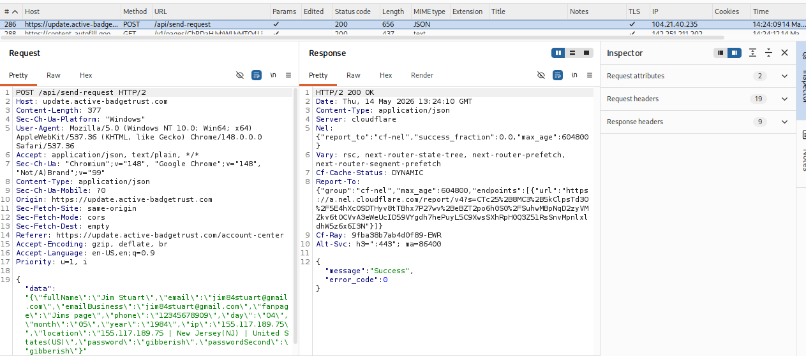

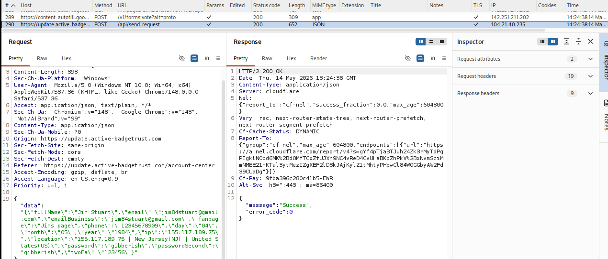

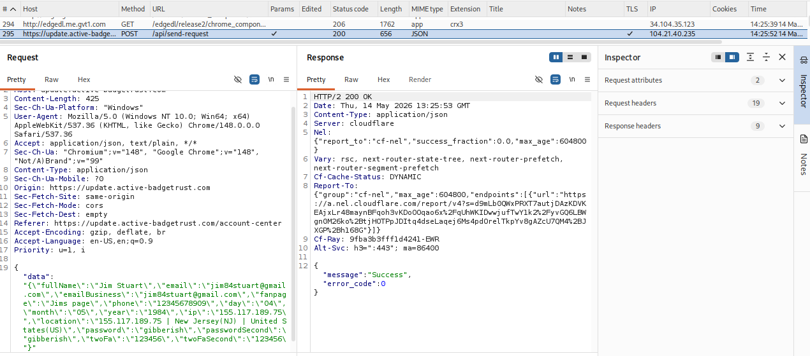

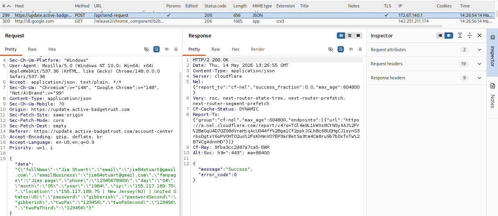

## Runtime IP Discovery and Localisation

The site performed public IP discovery using:

`api[.]ipify[.]org`

The phishing domain then called:

`/api/ip-location?ip=<victim_ip>`

The `/api/ip-location` response returned location and ISP data for the observed IP.

Evidence:

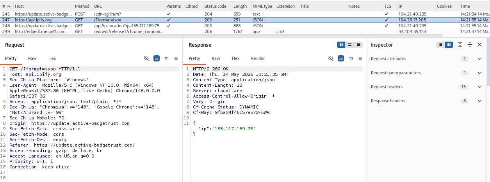

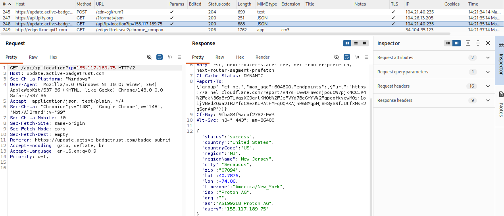

DevTools also briefly captured runtime requests before the page/session disrupted normal analysis, including `api.ipify.org` and an attempted `/api/ip-location?ip=` request.

Evidence:

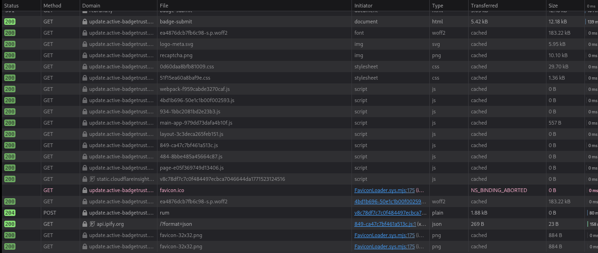

## JavaScript Artefacts

Identified API paths:

- `/api/ip-location?ip=`
- `/api/notification`
- `/api/send-request`

Evidence:

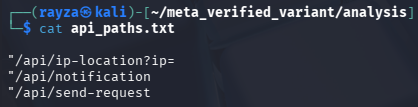

Observed staged localStorage keys:

- `__client_rec__fi_rst`
- `__client_rec__se_con`
- `__client_rec__th_ird`
- `__client_rec__fi_fiv_th`
- `__client_rec__si_x_th`
- `__client_rec__se_v_th`

Evidence:

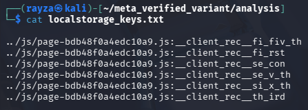

The client-side code also contained a hardcoded AES/localStorage key:

`HDNDT-JDHT8FNEK-JJHR`

Evidence:

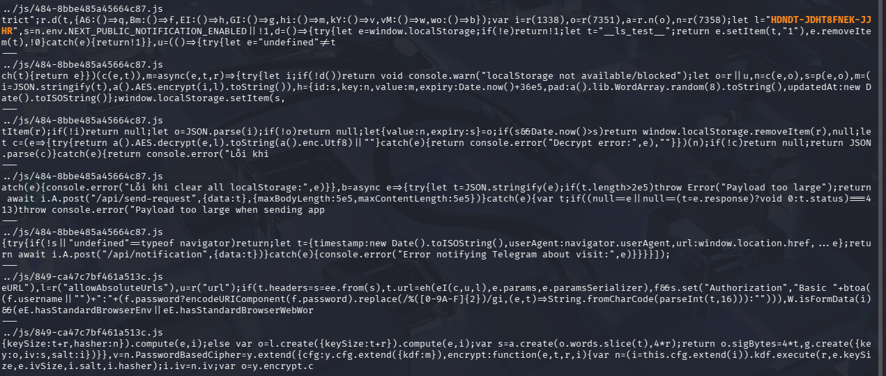

The JavaScript contained multilingual translation blocks for the same phishing workflow, including the fake CAPTCHA, Meta Verified request form, password prompt, OTP prompt, and success page. This suggests the phishing kit is designed for reuse across multiple regions.

## DevTools Disruption

Browser DevTools were unreliable during live testing. The page briefly loaded in DevTools, but the session/page then forced away or caused the visible network history to be reduced.

The current JavaScript also contains DevTools-detection/disruption logic, including checks associated with debugger timing, function/string conversion, window size, menu/copy/paste disabling, and console clearing.

Evidence:

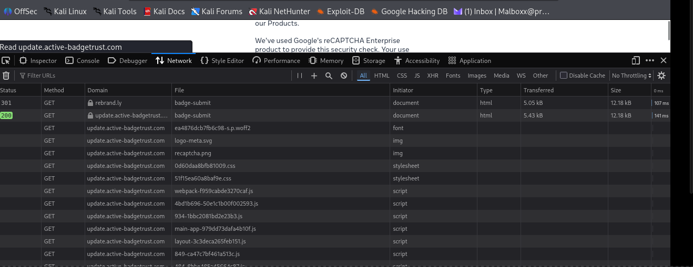

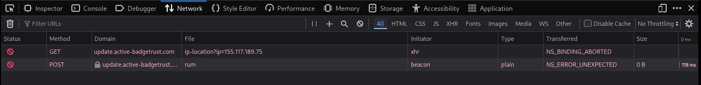

## Relationship to Previous Meta Verified Phishing Kit

Comparison with JavaScript files preserved from a previous Meta Verified phishing investigation showed strong code-level overlap.

Strong overlaps include:

- Meta Verified lure theme
- Instagram/PDF delivery style
- Rebrandly shortlink use
- fake CAPTCHA / verification gate
- `/account-center` style workflow
- `/api/send-request` endpoint
- two-stage password capture using `password` and `passwordSecond`
- three-stage OTP/2FA capture using `twoFa`, `twoFaSecond`, and `twoFaThird`
- same staged `__client_rec__` localStorage key family
- same hardcoded AES key: `HDNDT-JDHT8FNEK-JJHR`
- same Telegram-related notification error string in JavaScript
- DevTools disruption behaviour
- multilingual lure/flow translations

Differences observed in this variant:

- Current variant uses `active-badgetrust[.]com` rather than the previous hosting domain
- Current variant uses `api[.]ipify[.]org` plus `/api/ip-location?ip=`
- Current Burp capture showed readable JSON inside the `/api/send-request` `data` field
- No live Facebook 2FA relay was confirmed during this run

Assessment:

High confidence that this is the same phishing kit family or a closely related variant. Attribution to the same actor is not confirmed.

## Attribution Notes

Several artefacts contain Vietnam-linked metadata:

- PDF language metadata: `vi-VN`
- PDF author metadata: `Nguyễn Trọng Hoàng`
- WHOIS privacy metadata included `VN / Ha Noi`

These are weak metadata indicators only. They may reflect operator location, template origin, copied metadata, account aliasing, or deliberate misdirection. They should not be treated as attribution to a specific person or group.

## Indicators of Compromise

### URLs

- `hxxps://rebrand[.]ly/badge-submit`
- `hxxps://update[.]active-badgetrust[.]com/badge-submit`
- `hxxps://update[.]active-badgetrust[.]com/account-center`
- `hxxps://update[.]active-badgetrust[.]com/api/send-request`
- `hxxps://update[.]active-badgetrust[.]com/api/ip-location?ip=`

### Domains

- `active-badgetrust[.]com`
- `update[.]active-badgetrust[.]com`
- `rebrand[.]ly`
- `api[.]ipify[.]org`

### File Hash

- SHA-256: `8a3cf1b7676dbee798f84a2b22e41d232575150103dbaf573112d348ee3cfdd4`

### Infrastructure

- `104[.]21[.]40[.]235`
- `172[.]67[.]140[.]1`

Note: These are Cloudflare edge IPs and should not be treated as attacker-owned infrastructure.

### JavaScript Artefacts

- `checked-capcha`
- `/api/send-request`
- `/api/ip-location?ip=`
- `/api/notification`
- `passwordSecond`
- `twoFaSecond`
- `twoFaThird`
- `__client_rec__fi_rst`
- `__client_rec__se_con`
- `__client_rec__th_ird`
- `__client_rec__fi_fiv_th`
- `__client_rec__si_x_th`
- `__client_rec__se_v_th`
- `HDNDT-JDHT8FNEK-JJHR`

## Evidence Package

Redacted evidence includes:

- Instagram delivery screenshot
- PDF hash and metadata screenshots
- embedded Rebrandly URI screenshot
- Rebrandly redirect screenshot
- WHOIS/domain creation screenshot
- rendered phishing page screenshots
- JavaScript workflow screenshots
- Burp `/api/send-request` screenshots with credentials and OTPs redacted
- Burp IP discovery and `/api/ip-location` screenshots

Evidence summary:

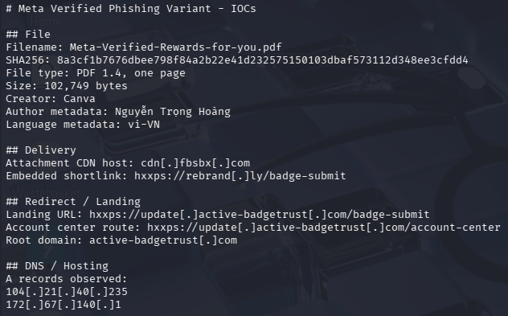

Raw Burp exports and unredacted screenshots are not included publicly because they contain burner account details, submitted test passwords, OTP values, cookies, and Cloudflare/session tokens.

## Limitations

This report confirms staged credential and OTP harvesting.

It does not confirm:

- real-time Facebook login relay
- successful account takeover
- confirmed Telegram notification during this live run
- attribution to a specific person or group

During testing, no real Facebook 2FA code was received for the burner account. Facebook traffic was observed only after the final user-facing redirect to `facebook.com`.

## Reporter

Jamie Roberts  
GitHub: `Rayza-Slyce`  
Purpose: phishing/takedown/abuse notification
